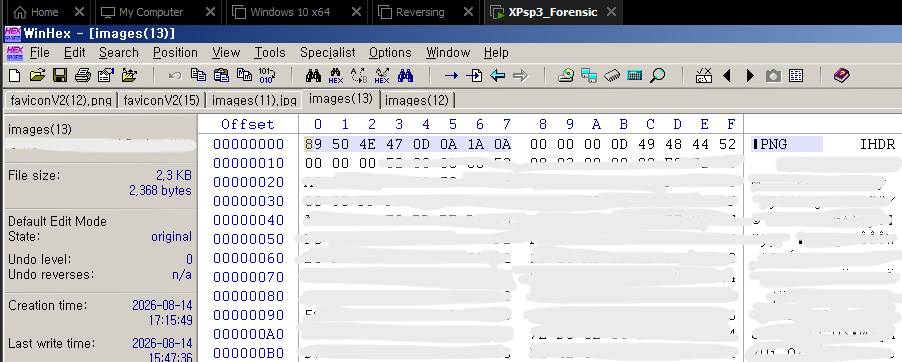
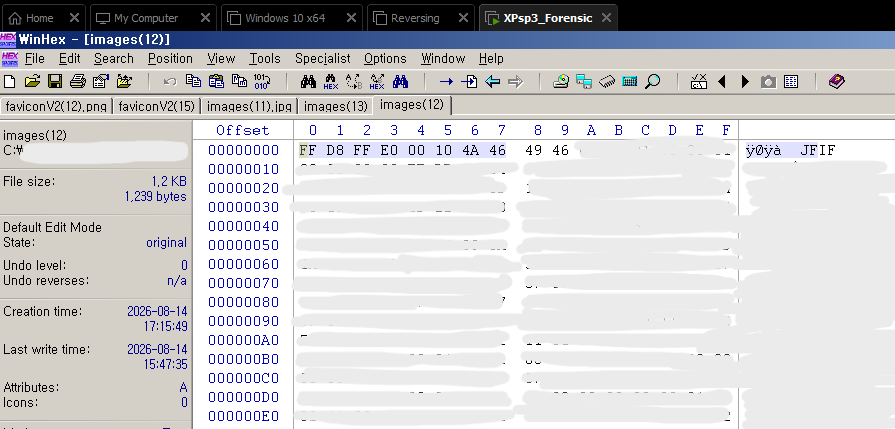

# 파일 시그니처를 이용한 파일 형식 분석

## 1. 분석 목적

확장자가 지정되지 않은 파일의 실제 파일 형식을 확인하기 위해 Hex Editor를 이용하여 파일의 시작 부분에 위치한 파일 시그니처(Magic Number)를 분석하였다.

## 2. 파일 시그니처란?

파일 시그니처(File Signature)는 파일의 시작 부분에 저장된 특정 바이트 값으로, 파일의 실제 형식을 식별하는 데 사용된다.

파일의 확장자가 없거나 확장자가 실제 파일 형식과 다른 경우에도 파일 시그니처를 확인하면 실제 파일 형식을 판단할 수 있다.

## 3. PNG 파일 확인

PNG 파일은 다음과 같은 시그니처로 시작한다.

```text
89 50 4E 47 0D 0A 1A 0A
```


따라서 파일의 Offset 00000000에서 위 값이 확인되는 경우 실제 파일 형식이 PNG임을 판단할 수 있다.

파일 형식: PNG
권장 확장자: .png

## 4. JPEG 파일 확인

JPEG 파일은 다음과 같은 시작 값을 확인할 수 있다.

```text
FF D8 FF E0 00 10 4A 46 49 46
```


파일의 Offset 00000000에서 위 값이 확인되는 경우 실제 파일 형식이 JPEG임을 판단할 수 있다.

또한 다음 값:
```text
4A 46 49 46
```
은 ASCII 문자로 변환하면 JFIF가 된다.

따라서 다음과 같은 구조를 확인할 수 있다.
```
FF D8 FF E0 00 10 4A 46 49 46
|         |           |
|         |           └─ JFIF
|         └─ JPEG APP0 마커
└─ JPEG 시작 시그니처
```
이를 통해 해당 파일이 JPEG/JFIF 형식임을 확인할 수 있다.

파일 형식: JPEG/JFIF
권장 확장자: .jpg

## 5. 파일 시그니처 비교
파일 시그니처	실제 파일 형식	확장자
89 50 4E 47 0D 0A 1A 0A	PNG	.png
FF D8 FF E0 ... JFIF	JPEG/JFIF	.jpg

확장자가 없는 파일도 Offset 00000000의 파일 시그니처를 확인하면 실제 파일 형식을 식별할 수 있다.

## 6. 분석 결과

파일의 확장자만으로 파일 형식을 판단하지 않고, Hex Editor를 이용하여 파일의 실제 시작 바이트를 확인하는 방법을 학습하였다.

이를 통해 확장자가 없거나 잘못 지정된 파일도 실제 파일 형식을 확인할 수 있으며, 파일 분석 및 디지털 포렌식에서 파일 시그니처가 중요한 역할을 한다는 것을 확인하였다.

## 7. 사용 도구
WinHex
Hex Editor

파일 시그니처(Magic Number) 분석 - 0814

